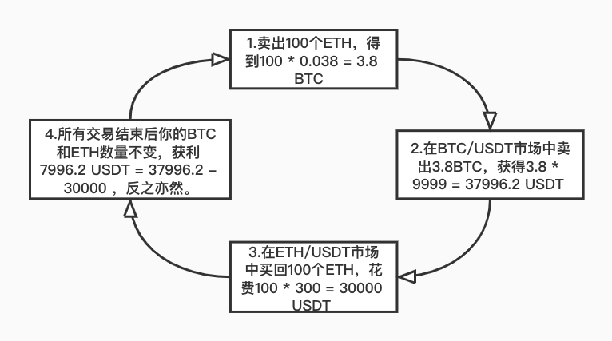

# 三角套利策略

## 策略说明

三角套利又叫间接套利或多边套利，起源于外汇市场中利用交叉汇率定价错误进行的套利。

**所谓三角套利，是一种引入三种货币的套利手段。它利用三种外汇对合理交叉汇率的暂时性偏离来实现套利。理论上，如果我们拥有很低延迟的下单平台，并且可以获得较低的买卖价差，那么我们有机会实现无风险套利**。

三角套利在数字货币市场同样适用，通常情况下，数字货币之间的汇率与其相对应的美元价格相关。但由于数字货币市场波动性较强，部分交易所由于流动性不足等各种原因，会造成某些时刻，**合成交叉价格和市场价格的暂时偏离**，当这种偏离足够抵消我们的交易成本时，我们便可使用三角套利方法实现无风险利润。

**适用情况**：行情有较大波动时，不同交易标的涨跌幅不同导致的不同交易对之间的价格变动之后。

**举个例子**，现货市场现有这样三个交易对：BTC/USDT，ETH/USDT，ETH/BTC。

假设前提是：市场中的手续费为零:  

BTC/USDT买1 = 9999 USDT，卖1=10000 USDT；  

ETH/USDT买1 = 299 USDT，卖1 = 300 USDT；  

ETH/BTC买1 = 0.029901 BTC，卖1 = BTC 0.03001 BTC。  

我们根据BTC/USDT以及ETH/USDT的现价计算出ETH/BTC的现价，计算后得知ETH/BTC的理论买1 = 0.029902 BTC，卖1 = 0.03000 BTC，与市场现价基本吻合。  

若某时刻价格出现波动，**ETH/BTC买1变为0.038 BTC，卖1变为0.039 BTC，另外两个交易对价格不变**。

最终，所有盈亏均反映在USDT上，我们在市场行情的波动下，利用价差实现了三角套利。

**优势**：受交易标的价格涨跌影响较小，无行情剧烈变动导致的大额亏损，总体风险较小。

**劣势**：挂单变动导致价格滑点；交易存在手续费成本；可能存在套利后未及时兑换成稳定币，持有币种价格下跌导致亏损的风险；受交易数据延迟以及交易所订单撮合性能影响较大。

**此外，KuCoin拥有level3级别的交易数据、极优的撮合引擎，以及对api用户提供特别的手续费折扣，极大程度的减少了你在策略实施时的劣势，同时提供sandbox环境作为数据测试支撑，帮助你规避风险。**

**不过，请注意，如果你想在实际环境中利用策略获得稳定的盈利，我们希望你能够在sandbox环境配合其他参数或是策略进行测试调整，以使你能够达到目的，我们也非常期待你能分享你的测试数据以及独到的见解。**

**当然，如果这个过程中，你遇到任何问题需要帮助亦或是有赚钱的策略想要分享，请在ISSUE中反映，我们会努力及时响应。**

